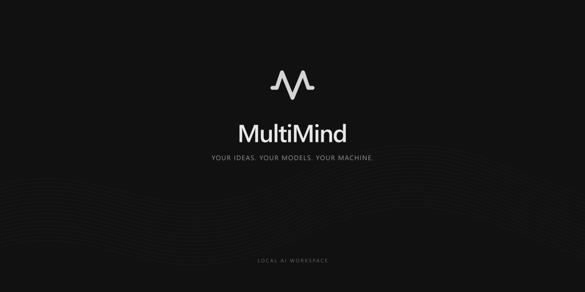

<p align="center">
  
</p>
<p align="center">
  <a href="https://github.com/Kuloka/MultiMind/releases/tag/1.19">Download for Windows, macOS and Linux</a> &nbsp; / &nbsp;
  <a href="#development">Development</a>
</p>

# MultiMind

[Product website](https://musical-ai.pages.dev/) · [Latest downloads](https://github.com/Kuloka/MultiMind/releases/latest)

Local desktop AI studio built with Electron. MultiMind can prepare a compact model without installing Ollama, and split a request between specialist agents before producing a combined answer.

## Windows installation

Run the generated MultiMind Setup executable, then choose **Quick setup** in the welcome screen. It downloads a pinned llama.cpp CPU runtime (18.6 MB) and Qwen2.5 1.5B Instruct Q4_K_M (1.12 GB), verifies both using SHA256, and starts the model automatically. Interrupted downloads can resume. If Microsoft Visual C++ runtime libraries are missing, setup downloads their signed 25.6 MB installer from Microsoft and launches it; Windows may request administrator confirmation. This prerequisite path was inspected but not exercised on a clean Windows installation. No Node.js, Python, API key, or Ollama installation is needed for this path.

Quick setup currently supports **Windows x64** and text conversations. The small starter model is intended for getting started; it is not a replacement for a larger coding model. The runtime binds only to loopback and stops when MultiMind exits. Models need an internet connection to download; generation with the prepared model works locally. The existing optional web search feature can still make internet requests.

Existing Ollama installations are detected and started automatically. **Install Ollama instead** installs it from the app; downloading an Ollama catalog model also prepares Ollama when necessary. Other platforms currently use Ollama. The welcome screen provides the model download size before setup starts.

## macOS and Linux installation

Release 1.19 includes macOS DMGs for **Apple Silicon (arm64)** and **Intel (x64)**, plus Linux x64 **AppImage** and **Ubuntu/Debian .deb** packages. On Mac, open the DMG and drag MultiMind to Applications. These builds are unsigned and not notarized by Apple; macOS may require approval in Privacy & Security. On Linux, install the .deb or make the AppImage executable before launching it; AppImage may require FUSE.

For local models on these platforms, install Ollama and select the **Ollama** tab in the model catalog. The **Without Ollama / Quick setup** engine is Windows x64 only. Ollama Cloud is also available through settings. All four native CI jobs run the automated suite and check that the packaged app launches; inference on every platform and clean-machine installer flows have not been tested.

## Agent team

**Agents - Auto** enables a coordinator that proposes up to two independent subtasks. Specialists receive the conversation context and assigned task, and the main model combines their drafts. Simple or indivisible requests skip the specialists. Image requests use the existing vision path.

The team panel displays actual request states, model names, elapsed time, assignments, and returned drafts. Stop cancels the active team requests and final response. Failed workers are shown as errors; their output is excluded from synthesis. Workers analyze supplied context and draft text/code; they do not independently execute tools or edit files. Existing main-response file handling remains responsible for project writes.

Settings let each specialist use the main model or another installed text model. The embedded engine shares one set of model weights across up to two request slots, falling back to one at startup when available RAM is below 6 GiB or there are fewer than four logical CPUs. Ollama schedules its own requests and may queue them. Multiple agents can take longer than one model; acceleration is not guaranteed.

## Development

```sh
npm install
npm start
npm run check
npm test
npm run dist:win
```

`dist:win` builds an NSIS installer and a portable executable. On PowerShell systems that block npm.ps1, use `npm.cmd`. `install.cmd` prepares development dependencies; end users should use the generated installer.

Data lives in ~/.multimind-data and projects in ~/MultiMindProject. On first launch, existing legacy chats, settings, downloaded models and projects are imported once without overwriting current files. Original folders remain as backups. Installer upgrade identity is preserved.

## Upstream components

- [llama.cpp b10549](https://github.com/ggml-org/llama.cpp/releases/tag/b10549), MIT license; the downloaded archive retains its upstream files.
- [Qwen2.5 1.5B Instruct GGUF](https://huggingface.co/Qwen/Qwen2.5-1.5B-Instruct-GGUF), Apache 2.0 model license.
- [Ollama](https://ollama.com/) remains an optional model backend.

The starter engine and model are downloaded separately and are not bundled into the application installer.

## Downloading more models without Ollama

The text catalog defaults to Without Ollama. Compatible GGUF text models download directly from the public model registry and run through the built-in CPU engine. The registry is a download source; the Ollama application is not needed. Downloads verify SHA256 and GGUF format and are saved in the managed runtime model index. Select the Ollama tab for the separate Ollama backend, including vision models.

The built-in engine loads one model at a time. Specialists sharing that model can use its parallel slots; specialists assigned different built-in models run sequentially to avoid replacing a model during an active response.

## Local skills

Settings > Skills imports Markdown instruction files. Enable each skill explicitly; enabled instructions apply to the main model on subsequent requests. Imported files live in ~/.multimind-data/skills. Each imported skill is limited to 12,000 characters and the enabled set to 24,000. Skills are instructions, not executable plugins.

The window uses an integrated draggable title bar with minimize, maximize/restore and close controls.

## Discord Activity

Settings > Discord Activity enables Rich Presence using the built-in MultiMind application ID. The default animated string logo is hosted publicly on GitHub. A running Discord desktop client and activity sharing enabled in Discord are required. The sidebar logo animates only on hover.

Custom HTTPS image URLs or Discord asset names override the default logo; clear the field to restore it. Add prepares a local image/GIF (up to 1024 pixels on its longest side), preserves animation, and warns about small images. Custom files need public hosting before Discord can display them. No bot token is required.

## MCP Plugins

Settings > Plugins manages local stdio and remote Streamable HTTP MCP connections. Add a connection, then enable it to start the server and discover tools. Local servers need their executable/runtime installed; HTTP connections currently support endpoints without OAuth or custom authentication headers.

The built-in Workspace connection ships with the app and exposes `list_projects`, `list_files`, and `read_text_file` inside MultiMindProject. It does not require Node.js to be installed separately. Imported connections are disabled by default; enabled connections reconnect on application startup. Settings are stored in `~/.multimind-data/plugins.json`.

On text requests, the main model can select tools through a bounded JSON planning loop (at most four calls, at most 40 advertised tools). Ask mode prompts before calls, Full access runs without those prompts, and Plan mode disables tool execution. Stop cancels pending calls. Text results are passed to the main model and subagents as context. Unsupported model output does not execute a tool. OAuth, a plugin marketplace, and plugin UI extensions are not included.

Validation includes real stdio and HTTP MCP servers, approval denial, disabled connections, project path boundaries, and a Qwen 1.5B smoke run that selected a tool and used its result in the final answer. Other models may be less reliable at selecting tools.

## Ollama Cloud

Settings > Ollama Cloud connects through an Ollama API key created on the official account page. Keys are encrypted with Electron safeStorage (Windows DPAPI) in a separate local credential file and never returned to the chat renderer after saving. Saving a key does not verify the account or reveal its subscription; access is checked on model requests.

The cloud catalog refreshes from `https://ollama.com/api/tags`. Models marked `cloud:` use the official hosted chat API, without a local Ollama installation. Messages, attachments and selected tool context for these models are sent to Ollama. Local models retain their existing local route. Cloud calls stream responses and support cancellation.

The pricing dialog offers Free, Pro and Max links to Ollama's official pricing page. It opens for payment/credit errors, not simply because an account lacks a subscription. Authentication, rate limits and billing errors are handled separately. Displayed monthly prices are a dated reference; final checkout prices, available models and API credit terms are controlled by Ollama. Paid inference and checkout were not exercised with a live account.

## Download brand images

[Banner, 2560 x 1280](resources/branding/multimind-banner.png) / [GitHub image, 1280 x 640](resources/branding/multimind-github.png) / [Transparent icon](resources/branding/multimind-icon.png)

Regenerate the vector-based artwork with `node scripts/create-branding.cjs`.
